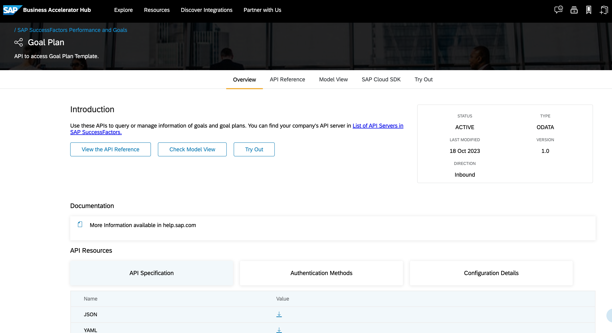
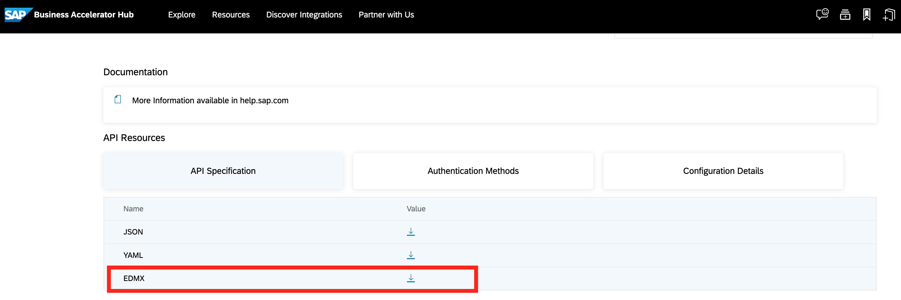

# Exercise 1 - Get and Import SuccessFactors Goal Plan Service

In this exercise, we will get the SuccessFactors Goal Plan Service API definition and import the service into our project.

## Exercise 1.1 Download specification from SAP Business Accelerator Hub

1.  Visit [SAP Business Accelerator Hub](https://api.sap.com/) and search for the keyword _"goal"_. You will find the listing for SAP SuccessFactors [Goal Plan OData v2 service](https://api.sap.com/api/PerformanceandGoalsPMGM/overview). (Why let the user search if the API is linked here anyways?)
Click on the listing and you will be redirected to the API specification page. You should see results like below:



2. Scroll down the page to find API specification of the service listed. Download the EDMX file by clicking on the download button.


Please note, you might have to log in with your trial account credentials.

For ease of understanding, please rename the downloaded file to `Goal.edmx` and place it in a folder of your choice.

If you are facing issues with logging in, for your convenience we have also included the service definition file in the `exercises/resources` folder of this repository (exercises/resources/Goal.edmx). 

You can use it directly for the next steps.

## Exercise 1.2 Add the Goal Plan service to your project

1. In your application's `pom.xml` (srv/pom.xml) file you can find the following dependency:
```xml
    <dependency>
        <groupId>com.sap.cds</groupId>
        <artifactId>cds-feature-remote-odata</artifactId>
        <scope>runtime</scope>
    </dependency>
```
This dependency is required to [enable CAP Remote Services](https://cap.cloud.sap/docs/java/remote-services#enabling-remote-services).
In layman terms, `Remote Services` are simply clients to remote APIs.

2. From your project's root folder (this is not the `srv` folder, it is `teched2023-AD266` folder), run the `cds import` with the path to the downloaded service definition file as a parameter. 

```bash
cds import /path-to-edmx-file/Goal.edmx --as cds
```

The output will look like this:
```bash
[cds] - imported API to srv/external/Goal
> use it in your CDS models through the like of:

using { Goal as external } from './external/Goal'

[cds] - updated ./package.json
```

The command will copy the service definition file to the `srv/external` folder of your project and convert it to CAP’s format CDS, which will be placed there as well (srv/external/Goal.cds).

Additionally, the file will be registered as service definition in the `package.json` file:

```json
{
  "cds": {
    "requires": {
      "Goal": {
        "kind": "odata-v2",
        "model": "srv/external/Goal"
      }
    }
  }
}
```

## Exercise 1.3 Configure a destination for the remote API

Destinations are used to define connections from your application to remote systems, and as we are trying to connect to a remote API, we need to define a destination for it.

1. In your application's `application.yaml` (src/main/resources/application.yaml) also add a destination for the imported service under `remote.services`:

```yaml
cds:
  datasource:
    auto-config.enabled: false
  remote.services:
    - name: "Goal"
      destination:
        name: "SFSF-BASIC-ADMIN"
        type: "odata-v2"
        suffix: "/odata/v2"
``` 

Please note, that the name of the destination given here will be re-used to create the destination in the SAP BTP cockpit eventually.

The `type` property defines the protocol used by the remote API which is an OData v2 service in this case. 

The `suffix` property value would be appended to the url obtained from the destination.

## Summary

You've now successfully added the SuccessFactors Goal Plan Service to your project.

Continue to - [Exercise 2 - Understand the existing Project setup](../ex2/README.md)

