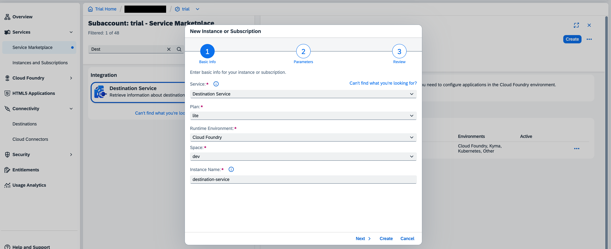

# Exercise 5 - Deploying the application to SAP Business Technology Platform

In this exercise, we will look at the steps required to deploy the application to SAP Business Technology Platform.

## Exercise 5.1 Creating a destination for SuccessFactors API endpoint

1. Please follow [this](https://developers.sap.com/tutorials/cp-cf-create-destination.html) tutorial to create a destination in your BTP Trial account cockpit with the following details:

```
Name: SFSF-BASIC-ADMIN
Type: HTTP
Url: https://apisalesdemo8.successfactors.com/
Proxy Type: Internet
Authentication: BasicAuthentication
User: <username-supplied-in-the-session>
Password: <password-supplied-in-the-session>
```

The resulting destination should look like this:


## Exercise 5.2 Creating a destination service instance

1. Navigate to the `Service Marketplace` in your BTP Trial account cockpit and find the `Destination` service and click on it.


2. Click on `Create` to create a new instance of the service.

3. Enter an `Instance Name` of your choice, everything else can be left as default. Click on `Create` to create the instance.



4.The created instance will be listed in the `Instances and Subscriptions` tab.


## Exercise 5.3 Adjusting the deployment descriptor - manifest.yml

1. In your project's root folder, open the `manifest.yml` file and edit the following lines and save the changes:

```diff
-#  services:
-#    - destination-service
+  services:
+    - <your-destination-service-instance-name>
```

## Exercise 5.4 Deploy the application and Test

1. We will use `CF CLI` to deploy the application.

2. Login into your BTP Trial account CF space by using the following command:

```bash
cf login -a API-URL -u USERNAME -p PASSWORD
```
where `API-URL` is the API endpoint of your BTP Trial account, you can see it in the Overview page and `USERNAME` and `PASSWORD` are the credentials you use to log in to your BTP Trial account cockpit.

3. Navigate to the project's root folder(`teched2023-AD266`)
   1. Run `mvn package` from the root folder to build your project.
   2. Once, the build finishes successfully, run `cf push` to deploy the application to your BTP Trial account.
   3. The url of the deployed application will be displayed in your terminal under `routes` section.

4. Once the application is deployed successfully, you can test the application by navigating to the application URL in your browser.
   Test `<your-application-url>/odata/v4/odata/v4/GoalService/` in your browser, you should see a similar response:
   ```json
   {
    "@context": "$metadata#GoalService.",
    "@metadataEtag": ""
   }
   ```
    You could also choose to test other application endpoints using `curl`.
   //Todo: Find and add the right endpoints for testing

## Summary

You've now successfully deployed your application to BTP CF and tested it.
